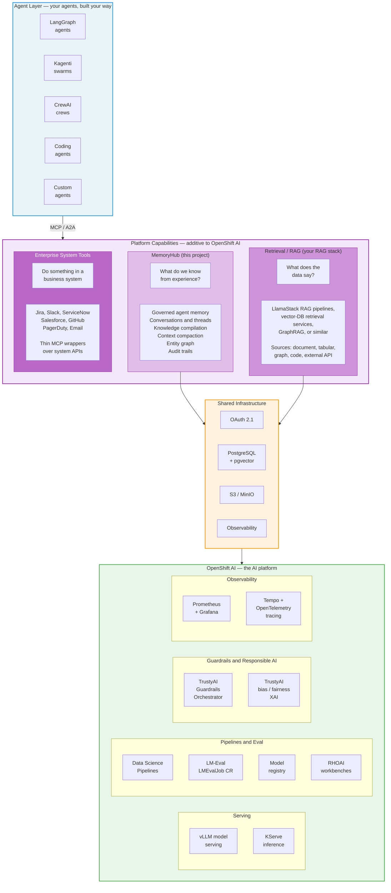

# Platform Architecture: Agent Services on OpenShift AI

How MemoryHub composes with the organization's retrieval/RAG layer and enterprise system tools as additive capabilities on OpenShift AI — without prescribing how agents are built.

**Status:** Living document. Captures the strategic positioning and integration model for MemoryHub within the platform services layer.

## The Core Principle

MemoryHub is **additive to the AI platform, not prescriptive of how you build agents.** It doesn't replace your agent framework, doesn't own your auth story, and doesn't tell you how to orchestrate. It gives any agent — regardless of framework — production-grade memory via standard protocols (MCP, A2A), alongside whatever retrieval and workflow-automation capabilities the organization already runs.

If your agent can call an MCP tool, it can use MemoryHub. Nothing else is required.

Agents typically compose three capability categories:

1. **MemoryHub** — a concrete platform service for governed agent memory ("what do we know from experience?").
2. **Retrieval / RAG** — a generic capability category ("what does the data say?"), provided by whatever RAG stack the organization runs: LlamaStack RAG pipelines, vector-DB retrieval services, GraphRAG, or similar. Not a specific product — MemoryHub composes with any of them.
3. **Enterprise system tools** — thin MCP wrappers over business systems ("do something in a business system").

## Architecture Overview (ASCII)

```
═══════════════════════════════════════════════════════════════════════════
                            AGENT LAYER
                   (your agents, built your way)
═══════════════════════════════════════════════════════════════════════════

  LangGraph      Kagenti       CrewAI      Coding         Custom
  agents         swarms        crews       agents         agents
     │              │             │             │              │
     └──────────────┴─────────────┴─────────────┴──────────────┘
                                  │
                            MCP / A2A
                                  │
═══════════════════════════════════════════════════════════════════════════
                        PLATFORM CAPABILITIES
                   (additive to OpenShift AI)
═══════════════════════════════════════════════════════════════════════════

  ┌───────────────────┐  ┌────────────────────┐  ┌────────────────────┐
  │    MemoryHub      │  │  Retrieval / RAG   │  │  Enterprise System │
  │  (this project)   │  │  (your RAG stack)  │  │  Tools             │
  │                   │  │                    │  │                    │
  │  "What do we know │  │  "What does the    │  │  "Do something in  │
  │   from            │  │   data say?"       │  │   a business       │
  │   experience?"    │  │                    │  │   system"          │
  │                   │  │  LlamaStack RAG,   │  │                    │
  │  Governed agent   │  │  vector-DB search  │  │  Jira, Slack,      │
  │  memory:          │  │  services,         │  │  ServiceNow,       │
  │   - Episodic &    │  │  GraphRAG, ...     │  │  Salesforce,       │
  │     procedural    │  │                    │  │  GitHub, PagerDuty │
  │   - Conversations │  │  Sources:          │  │  Email, Calendar   │
  │   - Knowledge     │  │   - Document       │  │  ...               │
  │     compilation   │  │   - Tabular        │  │                    │
  │   - Compaction    │  │   - Graph          │  │  Thin MCP wrappers │
  │   - Entity graph  │  │   - Code           │  │  over system APIs. │
  │   - Governance &  │  │   - External API   │  │  Stateless.        │
  │     audit trails  │  │                    │  │                    │
  └────────┬──────────┘  └─────────┬──────────┘  └────────────────────┘
           │                       │
           │    Shared infra       │
           ├───── OAuth 2.1 ───────┤
           ├───── PostgreSQL ──────┤
           ├───── S3 / MinIO ──────┤
           └───── Observability ───┘

═══════════════════════════════════════════════════════════════════════════
                          OPENSHIFT AI
                       (the AI platform)
═══════════════════════════════════════════════════════════════════════════

  Serving            Pipelines & Eval        Guardrails         Observability
  ┌──────────────┐   ┌──────────────────┐   ┌──────────────┐   ┌──────────────┐
  │ vLLM model   │   │ Data Science     │   │ TrustyAI     │   │ Prometheus + │
  │ serving      │   │ Pipelines        │   │ Guardrails   │   │ Grafana      │
  │              │   │ (KubeFlow v2)    │   │ Orchestrator │   │              │
  │ KServe       │   │                  │   │              │   │ Tempo +      │
  │ inference    │   │ LM-Eval          │   │ TrustyAI     │   │ OpenTelemetry│
  │              │   │ (LMEvalJob CR)   │   │ bias /       │   │ (tracing)    │
  │              │   │                  │   │ fairness /   │   │              │
  │              │   │ Model registry   │   │ XAI          │   │              │
  │              │   │ RHOAI workbenches│   │              │   │              │
  └──────────────┘   └──────────────────┘   └──────────────┘   └──────────────┘
```

## Architecture Overview (Mermaid)



## Value Proposition by Layer

### Agent Layer

The integration point is MCP (for tool access) and A2A (for agent-to-agent communication). No framework dependency. LangGraph, Kagenti, CrewAI, coding agents, or anything custom — if it can call an MCP tool, it has access to governed memory, data retrieval, and enterprise system automation.

### Platform Capabilities Layer

Three distinct capabilities, each with a clear boundary:

| Capability | Question it answers | Data model | Who writes | Who reads |
|---------|-------------------|------------|------------|-----------|
| **MemoryHub** | "What do we know from experience?" | Memory tree: branches, versions, scopes, curation, conversations, compiled knowledge | Agents (governed) | Agents (scoped) |
| **Retrieval / RAG layer** | "What does the data say?" | Indexed corpora and knowledge sources — documents, tables, graphs, code, external APIs | Source owners + ingestion pipelines | Agents (access-controlled per source) |
| **Enterprise System Tools** | "Do something in a business system" | None — stateless wrappers over system APIs | Agents (actions) | Agents (results of actions) |

**MemoryHub** is the agent's experience made durable and governable. Episodic memory, procedural memory, conversation threads, knowledge compilation, context compaction, entity graphs — all with versioning, scope isolation, tenant isolation, contradiction detection, and audit trails. Designed for regulated industries where "what did the AI know, and when?" is a compliance requirement.

**The retrieval/RAG layer** is the organization's data made accessible to agents. An agent says "get me data that answers X" and the RAG stack handles retrieval, ranking, and source access — whether the data lives in a document store, a relational database, a knowledge graph, a code repository, or an external API. Organizations bring whatever they already run: LlamaStack RAG pipelines, vector-DB retrieval services, GraphRAG, or a custom stack. MemoryHub composes with any of them and takes no dependency on a specific one.

**Enterprise System Tools** are how agents interact with business systems. Create a Jira ticket, send a Slack message, update a Salesforce record, trigger a PagerDuty alert. Each tool is a thin MCP wrapper over one system's API. Stateless, single-purpose, composable.

### Shared Infrastructure

MemoryHub and a typical RAG service naturally share infrastructure:

- **OAuth 2.1**: Common auth substrate. MemoryHub issues and validates JWTs; a RAG service can do the same. They can federate through a shared auth service or operate independently.
- **PostgreSQL + pgvector**: Primary storage for MemoryHub, and a common backing store for RAG services. Relational data, vector similarity search, and graph relationships in a single database.
- **S3 / MinIO**: Object storage for compiled knowledge articles (MemoryHub), source corpora and blobs (a RAG service), and cold-path compliance archives (both).
- **Observability**: Metrics to Prometheus, traces to Tempo via OpenTelemetry, dashboards in Grafana — the same pattern serves both.

Enterprise system tools are third-party MCP servers — they sit alongside these services in the agent's tool inventory but don't share infrastructure.

### OpenShift AI Platform Layer

MemoryHub is additive to, not competing with, the OpenShift AI platform — and the same platform components serve the retrieval layer:

**Model Serving & Inference**
- **vLLM model serving**: Hosts embedding models and rerankers used by MemoryHub and RAG services alike (e.g., all-MiniLM-L6-v2 for embeddings, ms-marco-MiniLM-L12-v2 for reranking). Also hosts LLMs for MemoryHub's knowledge compilation and for query rewriting in RAG pipelines.
- **KServe**: Inference serving for model endpoints consumed by platform services.

**Guardrails & Responsible AI**
- **TrustyAI Guardrails Orchestrator**: Protects model inputs/outputs from harmful content. Platform services route LLM calls through guardrails when policy requires it (e.g., knowledge compilation on sensitive scopes).
- **TrustyAI bias/fairness/XAI**: Monitors for bias in model outputs. Relevant when platform services use LLMs for entity extraction, memory compilation, or query rewriting — ensuring these transformations don't introduce or amplify bias.

**Evaluation**
- **LM-Eval (LMEvalJob CR)**: Evaluates LLM performance on standard benchmarks. Platform services can use this to validate that models used for compilation, extraction, or rewriting meet quality thresholds before deployment.

**Observability**
- **Prometheus + Grafana**: Metrics collection and visualization. MemoryHub exports service-level metrics (request latency, memory operations/sec, search recall, compilation queue depth) and model-level metrics (embedding latency, reranker accuracy); RAG services export the equivalent.
- **Tempo + OpenTelemetry**: Distributed tracing across the full request path — from agent MCP call through auth, service layer, database, and model inference. Enables end-to-end latency analysis and debugging.

**Pipelines & Workbenches**
- **Data Science Pipelines** (built on KubeFlow Pipelines v2): Orchestration for batch operations — RAG ingestion pipelines, MemoryHub compilation sweeps, scheduled health-check linting.
- **RHOAI workbenches**: Interactive environments for data scientists to develop and test retrieval sources, evaluate memory quality, and prototype new compilation strategies.
- **Model registry**: Tracks versions of embedding models, rerankers, and compilation LLMs used by the platform services.

## How They Compose: A Worked Example

An agent handling a customer-reported critical bug in the billing module:

```
Agent: "Customer reports critical billing bug"
  │
  ├─→ MemoryHub: search_memory("billing bugs, past incidents")
  │   └─ "Last billing incident (3 months ago) was tax calculation service.
  │      Platform team fixed it. Root cause: connection pool exhaustion
  │      after deploy. Resolution took 4 hours."
  │
  ├─→ RAG layer: retrieve("billing module architecture and failure modes")
  │   └─ Returns ranked chunks from:
  │      - Architecture docs (document source)
  │      - Recent deploy changelog (tabular source)
  │      - Service dependency graph (graph source)
  │      Whatever RAG stack the org runs handles source selection
  │      and ranking.
  │
  ├─→ Jira MCP: create_issue(project="BILL", type="Bug", priority="P1",
  │     assignee="platform-team", description="...")
  │   └─ Created BILL-1234
  │
  ├─→ Slack MCP: post_message(channel="#billing-oncall",
  │     text="P1: BILL-1234 — billing bug, potentially related to
  │     recent deploys. Similar to tax calc incident 3 months ago.")
  │
  └─→ MemoryHub: write_memory("Billing module critical bug 2026-04-10.
      Potentially related to 3 deploys this week. Tax calculation service
      flagged as repeat failure point. BILL-1234 opened, platform team
      assigned.")
```

Each capability handles one concern. The agent's reasoning is simple: I need context, I need data, I need to act, I need to remember.

## EU AI Act Compliance Out of the Box

The EU AI Act (phased enforcement through August 2, 2026) mandates that high-risk AI systems maintain automatic event logging that links outputs to source data, model versions, and user prompts. Penalties reach 7% of global annual revenue or EUR 35 million. No agent framework provides Article 12-ready audit trails today.

MemoryHub's architecture provides demonstrable compliance support as a platform capability, not an aftermarket bolt-on:

| EU AI Act Requirement | MemoryHub Capability |
|---|---|
| **Article 12: Automatic logging** of events over the system lifetime | Conversation thread persistence (#168) with immutable append-only history, versioned memories, and provenance chains linking every memory to its source conversation |
| **Article 19: Traceability** from output back to input data and model version | Entity graph (#170) with `derived_from` relationships tracing memories → conversations → decisions. Compaction provenance (#169) records what was summarized and why |
| **Right to explanation** (GDPR Art. 22) | Graph traversal from any decision back through the rationale chain: "this decision was informed by memory X, which was extracted from conversation Y, turn Z" |
| **Right to erasure** (GDPR Art. 17) | Retention policies with cascade: delete a conversation thread and all extracted memories cascade (or are flagged for review). Dual-track storage preserves compliance records separately from operational data |
| **Data minimization** (GDPR Art. 5) | Governed compaction (#169): reduce operational context to the minimum necessary while archiving full records in cold storage for compliance |
| **Record-keeping** (financial/healthcare regulations) | Cold-path archive in S3/MinIO with tenant-isolated, immutable storage. 7+ year retention configurable per scope |

For regulated customers (government, financial services, healthcare, defense), this is the difference between "we built something that probably complies" and "we deployed a platform that was designed for compliance from the ground up." The governance substrate — scope isolation, tenant isolation, RBAC, versioning, contradiction detection, audit trails — isn't a feature we added; it's the foundation everything else is built on.

## Why Not Just Markdown Files?

Manus, OpenClaw, and Claude Code all converged on plain markdown files as their primary agent memory system ([Lanham, 2026](https://medium.com/@Micheal-Lanham/the-markdown-file-that-beat-a-50m-vector-database-38e1f5113cbe)). This is the right default for single-agent, single-user, local workflows — files are inspectable, versionable, cache-friendly, and human-editable.

MemoryHub doesn't replace that pattern. It's what you need when it breaks down:

| File-based memory works when... | You need a platform service when... |
|---|---|
| One agent, one user | Multiple agents, multiple users |
| Single session or local resume | Cross-session, cross-deployment persistence |
| Trust the agent completely | Need audit trails and access control |
| No contradictions matter | Contradictions need detection and resolution |
| Context fits in one window | Knowledge compilation and compaction needed |
| No compliance requirements | EU AI Act, GDPR, financial regulations |

The failure modes that file-based systems hit — concurrent access corruption, semantic retrieval degradation at scale, KV cache invalidation costs from dynamic context manipulation, and the "lost in the middle" attention problem — are the problems that governed platform services solve. MemoryHub and the broader platform architecture exist for the teams that have graduated past what a markdown file can do.

## Boundaries

These boundaries are intentional and load-bearing:

- **MemoryHub does NOT do retrieval.** It doesn't ingest document corpora, manage source catalogs, or abstract retrieval expertise. "What does the architecture doc say?" is the RAG layer's job.
- **A RAG layer does NOT do memory.** It doesn't track agent observations, version experiential knowledge, or handle contradictions. "What did we learn last time?" is MemoryHub's job.
- **Neither does actions.** "Create a ticket" or "send a message" is not their job. That's an enterprise system tool.
- **Enterprise system tools do NOT store knowledge.** They execute actions and return results. They don't curate, version, or govern data.
- **None of these prescribe how you build agents.** They are services, not frameworks. Any agent that speaks MCP can use them.
- **None of these own auth.** They use OAuth 2.1 and can integrate with whatever identity provider the cluster is configured for (OpenShift OAuth, external OIDC, etc.).

## Memory vs. Retrieval

MemoryHub and the retrieval/RAG layer are complementary, not competing. The dividing line: if the fact emerged from operational history, it's memory; if it would exist regardless of what any agent did, it's retrieval material.

| Dimension | MemoryHub | Retrieval/RAG layer |
|-----------|-----------|--------------------|
| Data type | Experiential — what agents observed, decided, learned | Semantic/factual — curated knowledge sources |
| Graph model | Governance graph — provenance, decisions, rationale chains | Knowledge graph sources — infrastructure, compliance, reference |
| Question | "Why is it this way?" / "What did we learn?" | "What is this?" / "What does the data say?" |
| Mutability | Continuous — grows with agent experience | Versioned source corpora managed by owners |
| Ingestion | Agents write observations; platform compiles knowledge | Source owners curate; ingestion pipelines process |
| Governance | Scope isolation, tenant isolation, RBAC, audit trails | Source-level access control, evaluation suites, lineage |

Together they provide both the agent's institutional memory and the organization's accessible knowledge — the librarian's journal and the reference shelf.
